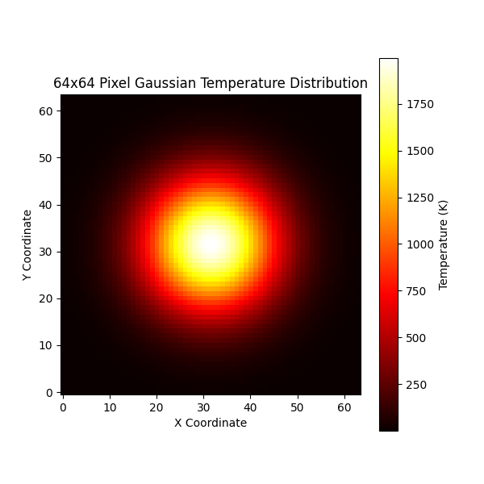
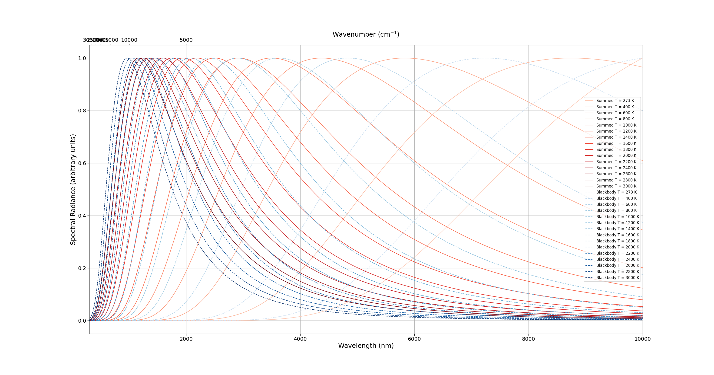
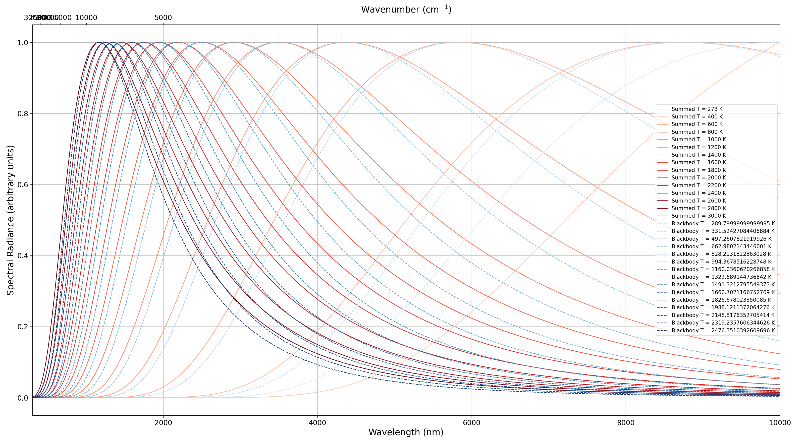
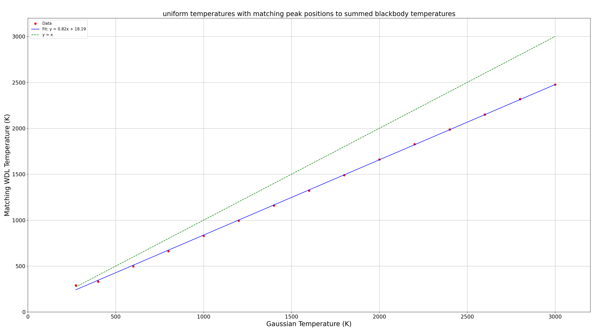
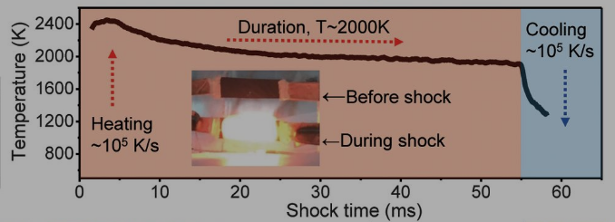

# Blackbody Spectra Summing

A few scripts written to begin to gauge the feasibility of building a blackbody thermometer for ultrafast, nanoscale temperature measurements.

## The problem

Among the many possible challenges includes the conflation of multiple blackbody temperatures across space.  This repository contains scripts to (1) crudely plot the temperature distribution of an irradiated sample and (2) sum the blackbody spectra of the individual temperatures to compare with the total blackbody spectrum and gauge distinctiveness given temperature range and thermal distribution.

## What we know

Our lab work has shown thus far that

- CB + CW (60 W) 808 nm laser irradiation has only achieved a maximum temperature of ~800 K
  
- pulsed (50 mJ) 1064 nm laser irradiation has achieved likely > 1000 K based on kinetic calculations, though likely if at all, only for durations on nanosecond timescales

## Current script findings

### **Figure 1:** Temperature distribution for a 2000 K center point and a Gaussian falloff

### **Figure 2:** Various summed blackbody spectra for a sigma = 10 distribution alongside pure blackbodies at *the corresponding temperatures*

### **Figure 3:** Various summed blackbody spectra for a sigma = 10 distribution alongside pure blackbodies at *the corresponding peak positions*

THEY'RE LOOKING PRETTY SIMILAR.  They are obviously all normalized, but what I care about is shape similarity anyway. Hopefully that will be mitigated with a homogenized thermal distribution.

### **Figure 4:** Difference in temperature for the blackbodies at the same peak position given a sigma = 10 distribution

These results are promising in some ways.  They do show that the difference between the real blackbody spectra and the summed blackbody spectra approaches 20% at increasing temperatures, but I believe this conflation of blackbodies is likely to be the worst case scenario and 20% is not too bad.  

### to-do

- [x] instead of using pure blackbody spectra at *the same* temperatures to compare against, use the Wein Displacement Law to find temperatures that produce the same peak

- [x] plot how the blackbody spectra vs summed spectra distinctiveness changes with temperature range

- [ ] plot the influence of the distribution (more than just distribution/sigma though...like, it can be a wide distribution as long as I'm only looking at the center, right?)

- [ ] record existing detector wavelengths, window sizes, and detectivities, to find what temperatures, emissivities, etc. would be necessary

- [ ] think on the thermal distributon (Is Gaussian a reasonable approximation?  Probably does not matter too much)

- [ ] make sure the overflow runtime warning from running the summation script is not critical

- [ ] optimize spectra summing script (it's radially symmetric, no need to calculate the same values multiple times... or do I?  would there be more outside points?  I need to sleep)

## Future considerations

Additional challenges include

- **Conflation across time** - since substantial cooling can occur for certain systems (e.g., pulsed lasers, MNPs, liquid solvent), a similar 'conflated blackbodies across a range of temperatures' problem will arise for increasing windows of time.  Nano-scale control over the measurement's time-resolution will likely need to be accessed through optics, the detector, or digitally
  
- **"exposure-triangle" problems** - getting strong enough signal with enough points to ensure high SNR and at spacing that optimizes fit accuracy (ideally enclosing the peak), especially considering the time constraint (see: detectivity)
  
- **Designing optics** - sensing optics need to focus to a small area, well-aligned with beam such that the thermal distribution is as homogenous as possible.  Moreover, beyond being able to withstand potentially the high powers of beam exposure needed to produce these temperatures, the optics may need to interface with a bulky air-free chamber
  
## Resources

- [Thor Labs Detectors Page](https://www.thorlabs.com/newgrouppage9.cfm?objectgroup_id=11319)

- ["Carbothermal Shock"](https://www.science.org/doi/10.1126/science.aan5412) (Yao et al., 2018) paper and SI
  

- thermal imaging techniques, microbolometry, etc.

- Wein Displacement Law: `λ_max = 2.898 x 10^-3 / T`