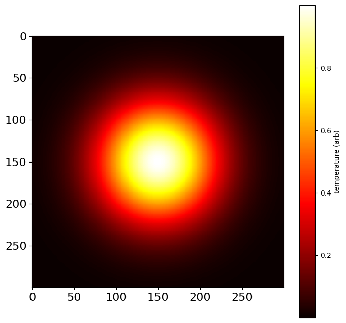

# Blackbody Spectra Summing

A script to begin to assess (and address) the challenges of building a blackbody thermometer for ultrafast, nanoscale temperature measurements.

## Problem 1: spatial conflation of blackbody temperatures

Among the many possible challenges (enumerated below) is the conflation of multiple blackbody temperatures across space.  Whereas a single blackbody spectrum can be used to determine the temperature of an object, the sum of a distribution of such blackbody spectra may present as a substantially different temperature depending on the distribution, the measurement, and the fitting method.  This script is a first step in understanding the challenges of this conflation.

It works by (1) plotting a temperature map Gaussian falloff based on an input temperature and standard deviation (2) finding and summing the blackbody spectra for each pixel's temperature to compare with the total blackbody spectrum.  Finally (3) it plots the difference in temperature between the two.

## Running the script

In `blackbodySpectraSumComparison.py`, run cell-by-cell to (1) visualize the distribution with the size (pixel length of one side of the square grid) and sigma parameters, (2) compare the simulated summed conflated blackbody spectra with 'pure' temperature blackbodies of the same peak position, and (3) plot the difference.

Note that when sigma >> size, the falloff will be entirely visible, resulting in the widest variety of temperatures and therefore the most conflated blackbody spectra (the least ideal situation).  Conversely, when sigma << size, the distribution will approach uniformity and the conflated spectra will be more similar to the pure blackbody spectra.

## Current script findings

### **Figure 1:** Thermal distribtuion with full falloff visibility (sigma = size/6)

This plot represents the worst case scenario of full falloff visibility where the temperature of interest (the peak temperature) represents just one of many blackbody spectra that will be summed to produce the total blackbody spectrum.  The question is, how distinct will the total blackbody spectrum be from the pure blackbody spectra?  Is the broadening enough to make a unique determination impossible?  The following two figures both seek to compare the conflated blackbody sums with the pure blackbodies.

### **Figure 2:** Various summed blackbody spectra for a fully visible Gaussian falloff alongside 'thermally uniform' blackbodies at the corresponding *maximum temperatures*

Here, the same temperatures are used to compare the blackbody spectra.  This is a good way to see how the shape of the blackbody spectra changes with temperature.  Another way to compare the blackbody spectra is to use the Wein Displacement Law with on the conflated blackbodies to find corresponding pure blackbody temperatures.

### **Figure 3:**  Various summed blackbody spectra for a fully visible Gaussian falloff alongside 'thermally uniform' blackbodies at the corresponding *peak positions*

Indeed, these peak-aligned spectra look similar and deviate from their counterparts by anywhere between 15 K and 500 K.  The following graph shows the how the difference in temperature changes with the peak temperature.

### **Figure 4:** Difference in temperature for the blackbodies at the same peak position given a sigma = 10 distribution

I find these results promising.  They do show that the difference between the real blackbody spectra and the summed blackbody spectra can something like 20%, but remember this is when the entire falloff is visible.  This suggests that the blackbody spectra will be distinct enough to be able to fit to the summed spectra and produce temperatures within ~20% of the real value.  And a well-positioned aperature and optical setup that can filter the temperature falloff will only improve the temperature estimates from there.

Indeed, for an image where sigma is even only equal to length, the difference between the spectra closes from a slope of 0.82 to 0.92:

### **Figure 5:** Distribution for sigma = size

### **Figure 6:** Blackbodies for sigma = size

### **Figure 7:** Peak temperature difference for sigma = size

### to-do

- [x] instead of using pure blackbody spectra at the *same temperatures* to compare against, use the Wein Displacement Law to find temperatures that produce the same peak

- [x] plot how the blackbody spectra vs summed spectra distinctiveness changes with temperature range

- [x] demonstrate the influence of narrowing the aperature by widening the distribution beyond the image bounds

- [ ] simulate binning at different wavelength windows to inform detector design/purchasing 

- [ ] simulate conflated time windows?  Would the cooling even follow a roughly conductive/convective model for bulk materials?

- [ ] record existing detector wavelengths, window sizes, and detectivities, to find what temperatures, emissivities, etc. would be necessary

- [ ] make sure the overflow runtime warning from running the summation script is not critical

- [ ] optimize spectra summing script (it's radially symmetric, no need to calculate the same values multiple times... or do I?  would there be more outside points?  I need to sleep)

## What we know

In the past, we've investigated the temperatures photothermal treatment can achieve.  For example, we know that

- CB + CW (60 W) 808 nm laser irradiation has only achieved a maximum temperature of ~800 K
  
- pulsed (50 mJ) 1064 nm laser irradiation has achieved likely > 1000 K based on kinetic calculations, though likely if at all, only for durations on nanosecond timescales

## Future considerations

Additional challenges include

- **Conflation across time** - since substantial cooling can occur for certain systems (e.g., pulsed lasers, MNPs, liquid solvent), a similar 'conflated blackbodies across a range of temperatures' problem will arise for increasing windows of time.  Nano-scale control over the measurement's time-resolution will likely need to be accessed through optics, the detector, or digitally
  
- **"exposure-triangle" problems** - getting strong enough signal with enough points to ensure high SNR and at spacing that optimizes fit accuracy (ideally enclosing the peak), especially considering the time constraint (see: detectivity)
  
- **Designing optics** - sensing optics need to focus to a small area, well-aligned with beam such that the thermal distribution is as homogenous as possible.  Moreover, beyond being able to withstand potentially the high powers of beam exposure needed to produce these temperatures, the optics may need to interface with a bulky air-free chamber
  
## Resources

- [Thor Labs Detectors Page](https://www.thorlabs.com/newgrouppage9.cfm?objectgroup_id=11319)

- ["Carbothermal Shock"](https://www.science.org/doi/10.1126/science.aan5412) (Yao et al., 2018) paper and SI
  

- thermal imaging techniques, microbolometry, etc.

- Wein Displacement Law: `λ_max = 2.898 x 10^-3 / T`